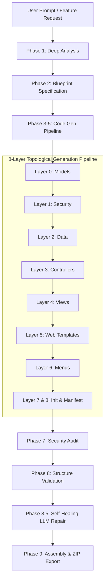

# 🏗️ OdooCode: The Multi-Agent Orchestration Engine

## What is OdooCode?
`OdooCode` is an advanced, 9-phase multi-agent engine designed to orchestrate the generation, validation, and self-healing of complete, production-ready Odoo 18 modules. Instead of relying on a single zero-shot prompt to generate an entire module (which frequently leads to hallucinations and broken XML dependencies), OdooCode breaks down the task into systematic phases.

It uses specialized AI agents (Analyst, Blueprint, Coder, Repair) that communicate with each other, passing context sequentially to build a module layer by layer.

---

## The 9-Phase Lifecycle

### Phase 1: Deep Analysis (`AnalystAgent`)
* **Goal**: Understand the user's raw prompt and extract domain requirements.
* **Process**: The user asks for a feature (e.g., "Build a multi-tenant Barber Shop SaaS"). The `AnalystAgent` expands this into a comprehensive technical requirement document, defining the necessary models, views, controllers, and access rights required for Odoo 18.

### Phase 2: Blueprint Specification (`BlueprintAgent`)
* **Goal**: Plan the exact file structure before writing any code.
* **Process**: Reads the Analysis and generates a strict JSON array of required files. 
* **Topological Sorting (`topological_sort()`)**: The engine automatically sorts these files in dependency order. 
  * *Layer 0*: `models/*.py`
  * *Layer 1*: `security/ir.model.access.csv`
  * *Layer 2*: `data/*.xml`
  * *Layer 3*: `controllers/*.py`
  * *Layer 4*: `views/*_views.xml`
  * *Layer 5*: Web Templates
  * *Layer 6*: Menus
  * *Layer 7/8*: `__init__.py` & `__manifest__.py`

### Phases 3-5: Code Generation Pipeline (`CoderAgent`)
* **Goal**: Write the actual code for each file sequentially.
* **Process**: The `CoderAgent` writes files in the topologically sorted order. 
* **Semantic Memory (BM25 RAG)**: When generating an XML view (e.g., `views/shop_views.xml`), the agent queries the `CodeKnowledgeStore`. It retrieves the exact AST signatures of the Python models it generated earlier, ensuring it never hallucinates fields that don't exist.

### Phase 6: Code Assembly
* **Goal**: Save all generated code to the local file system (`odoocode_output/<module_name>`).

### Phase 7: Security Audit (`SecurityAuditor`)
* **Goal**: Ensure the module won't crash Odoo upon installation due to missing ACLs.
* **Process**: Scans all `models/*.py` files and verifies that a corresponding read/write/create/unlink rule exists in `ir.model.access.csv` or `security.xml`.

### Phase 8: Structure Validation (`ModuleStructureValidator`)
* **Goal**: Ensure XML-to-Python referential integrity.
* **Process**: Uses regular expressions and Python's `ast` module to verify that:
  1. Every `<field name="X">` in XML exists in the corresponding Python model.
  2. Every `_name` referenced in security CSVs exists in a Python model.
  3. Every file listed in `__manifest__.py` actually exists on disk.
  4. Controller `request.render()` calls match `<template id="...">` tags in XML templates.
  5. OWL JS action registrations match `ir.actions.client` tags in XML views.

### Phase 8.5: Self-Healing LLM Repair (`_auto_heal_structure()`)
* **Goal**: Automatically fix errors detected in Phase 8 without human intervention.
* **Process**: This is the engine's "Reflection" capability. If the validator detects that the XML view calls `<field name="price"/>` but `price` is missing from the Python model, the engine intercepts the error. It invokes the `RepairAgent`, passing the exact error string and the Python file contents. The `RepairAgent` intelligently injects the missing `price = fields.Float()` into the Python class, successfully healing the codebase.

### Phase 9: Final Assembly & ZIP Export
* **Goal**: Package the validated module.
* **Process**: Compresses the validated directory into a deployable `.zip` file ready for Odoo 18 installation.

---

## Core Technologies Used in OdooCode
1. **Ollama**: Local inference engine running our fine-tuned `odoo18-coder-v3` model.
2. **Pydantic**: Enforces strict JSON schemas for agent communications (e.g., ensuring the BlueprintAgent only returns valid file paths).
3. **BM25 Semantic Retrieval**: A lightweight search algorithm used in `CodeKnowledgeStore` to give agents short-term memory of the files they just wrote.
4. **AST (Abstract Syntax Trees)**: Used for parsing Python files locally to extract field names and class declarations without needing to boot up an actual Odoo database.
