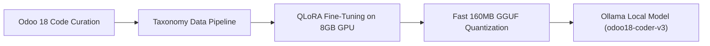
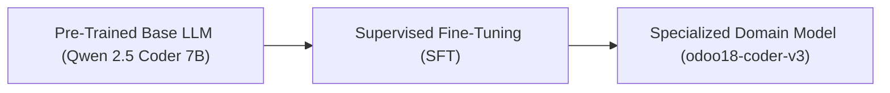
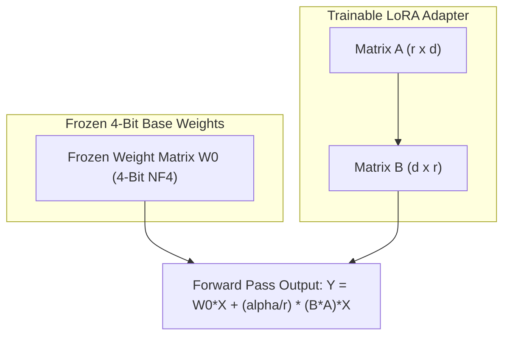
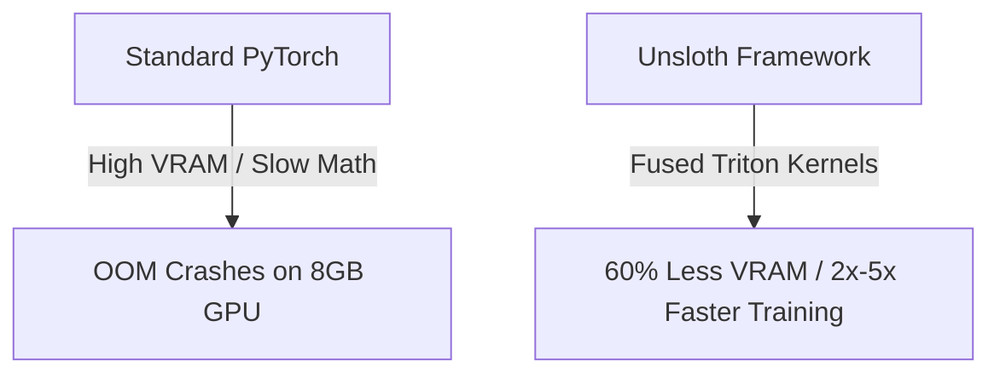
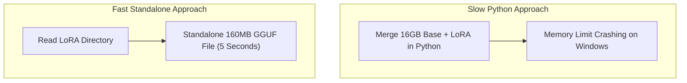
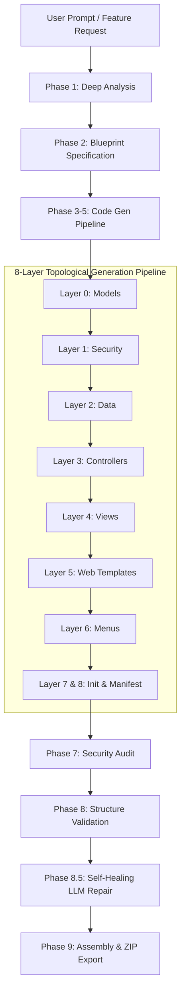

# ⚡ OdooCode: Autonomous Multi-Agent Odoo 18 Engine

> **OdooCode** is a multi-agent orchestration framework designed to generate, validate, and self-heal production-ready Odoo 18 modules. It combines topological code generation, semantic RAG memory, and self-healing reflection passes.

---

## 🚀 Quick Start & CLI Usage

OdooCode provides versatile execution modes for creating new modules, refactoring existing code, or running interactive workflows.

### 1. Quick Command Mode (One-Shot Builder)
Generates a complete, multi-file Odoo 18 module from scratch in one autonomous run:
```bash
python -m odoocode "Create a multi-tenant Barber Shop SaaS module with appointment booking, website routes, and dashboard" ./odoocode_output
```

### 2. Interactive Agent Mode (Default TUI)
Launches the persistent Terminal User Interface (TUI) agent with chat context:
```bash
python -m odoocode
```

### 3. Interactive Wizard Mode
Launches a step-by-step interactive questionnaire to configure your module:
```bash
python -m odoocode --wizard
```

### 4. Existing Codebase Mode
Refactors, edits, or adds features to an existing Odoo addon directory:
```bash
python -m odoocode --codebase ./custom_addons/my_module "Add a cancellation reason field to appointments"
```

### 5. Backward-Compatible Alias
If you prefer using the legacy command name, `forge` acts as a seamless alias:
```bash
python -m forge "Create fleet management module"
```

---

## 🛠️ Multi-Provider & Model Configuration Guide

OdooCode features a flexible **Multi-Provider Architecture**. You can run it 100% offline using local Ollama models, or connect it to cloud APIs like OpenAI, Anthropic, or OpenRouter.

### 1. Supported Providers & Syntax Tags

| Provider | Syntax Format | Example Model Tag | Required API Key |
| :--- | :--- | :--- | :--- |
| **Ollama (Local)** | `model_name` | `odoo18-coder-v3:latest` | None (Runs locally) |
| **OpenAI** | `openai/model_name` | `openai/gpt-4o` | `OPENAI_API_KEY` |
| **Anthropic** | `anthropic/model_name` | `anthropic/claude-3-5-sonnet-20241022` | `ANTHROPIC_API_KEY` |
| **OpenRouter** | `openrouter/vendor/model_name` | `openrouter/meta-llama/llama-3.3-70b-instruct` | `OPENROUTER_API_KEY` |

### 2. Setting API Keys (via `.env` or Environment Variables)

You can easily configure your API keys by creating a `.env` file in the root directory (copied from `.env.example`):

```bash
# Copy example template
cp .env.example .env
```

Edit `.env`:
```ini
OPENAI_API_KEY=sk-...
ANTHROPIC_API_KEY=sk-ant-...
OPENROUTER_API_KEY=sk-or-...
```

OdooCode will automatically load the `.env` file on startup! Alternatively, you can set keys directly in your terminal:

```bash
# Windows PowerShell
$env:OPENAI_API_KEY="sk-..."
$env:ANTHROPIC_API_KEY="sk-ant-..."
$env:OPENROUTER_API_KEY="sk-or-..."

# Linux / macOS Bash
export OPENAI_API_KEY="sk-..."
export ANTHROPIC_API_KEY="sk-ant-..."
export OPENROUTER_API_KEY="sk-or-..."
```

---

### 3. Model Roles & Tier Mapping

OdooCode delegates tasks to specialized agent roles. You can assign different models to different roles depending on speed, cost, or reasoning power.

| Role Tag | Primary Task | Default Assignment |
| :--- | :--- | :--- |
| `coder` | Generates Python models, views, controllers, & QWeb templates | `odoo18-coder-v3:latest` |
| `planner` | Performs Phase 1 Analysis and Phase 2 Blueprint sorting | `odoo18-coder-v3:latest` |
| `critic` | Performs Phase 7 Security Auditing and Phase 8 Code Review | `odoo18-coder-v3:latest` |
| `embed` | Generates vector embeddings for RAG Skills search | `nomic-embed-text:latest` |

---

### 4. Configuring Model Groups via File

You can define permanent model assignments by creating an `odoocode_config.json` file in your working directory:

```json
{
  "output_dir": "./odoocode_output",
  "num_ctx": 16384,
  "temperature": 0.15,
  "skills_dir": "./odoo-18.0-skills",
  "model_groups": {
    "coder": "odoo18-coder-v3:latest",
    "planner": "odoo18-coder-v3:latest",
    "critic": "odoo18-coder-v3:latest",
    "embed": "nomic-embed-text:latest"
  }
}
```

---

### 5. Overriding Models via CLI

You can override model assignments on the fly via command-line flags:

#### Using `--model-group`:
```bash
python -m odoocode --model-group coder=anthropic/claude-3-5-sonnet-20241022 --model-group planner=openai/gpt-4o "Create real estate module"
```

#### Using Role Flags (`-cm`, `-pm`, `-cr`):
```bash
python -m odoocode -cm anthropic/claude-3-5-sonnet-20241022 -pm openai/gpt-4o "Create hospital management module"
```

#### Listing Available Models Across All Providers:
To verify which local and cloud models are detected and accessible:
```bash
python -m odoocode --list-models
```

---

## 🧠 The Story Behind the Default Model (`odoo18-coder-v3`)

### 🤖 Auto-Detection of the Local Fine-Tuned Model
By default, OdooCode is pre-configured to use **`odoo18-coder-v3:latest`**. 
* If you have `odoo18-coder-v3:latest` installed in your local Ollama setup, **OdooCode will automatically detect it and use it out-of-the-box** for all code generation, planning, and self-healing passes without needing any API keys or cloud connections.
* If Ollama is not running or the model is not found, you can seamlessly pass any cloud model (e.g., `--model-group coder=anthropic/claude-3-5-sonnet-20241022`).

---

### 📖 How We Built a Local Brain on a Consumer Laptop

While frontier cloud models (like Claude 3.5 Sonnet or GPT-4) are exceptionally smart, using them for continuous local module generation can incur API costs and requires sending private business logic to external servers.

To solve this, we set out on an experimental journey: **Could we train our own specialized Odoo 18 model right on a single consumer laptop (with an 8GB GPU) and run it 100% locally?**

Here is the story of how `odoo18-coder-v3` was born:



#### 1. Data Generation & Taxonomy Curation
We curated a high-quality dataset of Odoo 18 syntax rules, atomic decorators, single-file models, and multi-file module architectures. We aggressively filtered out legacy Odoo 14/15 patterns (like `@api.multi` or `<tree>` views) to ensure the AI learned strictly modern Odoo 18 standards.



#### 2. Fine-Tuning on Consumer Hardware (QLoRA & Unsloth)
Using **Unsloth** and **QLoRA (Quantized Low-Rank Adaptation)**, we froze the base 7B model in 4-bit precision and only trained lightweight adapter matrices ($A$ and $B$). This allowed us to perform deep supervised fine-tuning on a normal consumer laptop GPU without running out of memory.



Unsloth uses **Fused Triton Kernels** to eliminate memory overhead, using **60% less VRAM** and speeding up fine-tuning by 2x-5x:



#### 3. Standalone GGUF Quantization & Ollama Deployment
Instead of heavy base-model merges, we converted the learned adapter into a standalone **160 MB GGUF** binary file in seconds:



We registered it with Ollama using a custom `Modelfile`, creating `odoo18-coder-v3:latest`.

👉 **For full fine-tuning source code, dataset scripts, Unsloth recipes, and training handbook, check out our companion repository:**  
🔗 **[Odoo18-AI-Coder Fine-Tuning Repository](https://github.com/prashantk8ursrvc-ux/Odoo18-AI-Coder)**

---

## 🏗️ OdooCode Multi-Agent Engine Architecture

OdooCode operates as an advanced **9-Phase Autonomous Multi-Agent Pipeline** designed to build production-ready Odoo 18 modules layer by layer.



---

### 📜 Detailed 9-Phase Generation Lifecycle

#### Phase 1: Deep Requirements Analysis (`AnalystAgent`)
* **Goal**: Expand raw user prompts into complete Odoo 18 technical requirement specifications.
* **Process**: Accepts high-level feature prompts (e.g. *"Create a multi-tenant Barber Shop SaaS module"*) and defines all required database models, statusbar workflows, public website routes, CSRF security rules, and OWL 2 client action dashboards.

#### Phase 2: Blueprint Specification & Topological Sorting (`BlueprintAgent`)
* **Goal**: Plan exact module file trees before writing code.
* **Process**: Generates a JSON array of target filepaths and performs **Topological Sorting (`topological_sort()`)** across 8 strict dependency layers:
  * **Layer 0**: `models/*.py` (Python database models)
  * **Layer 1**: `security/ir.model.access.csv` (Access Control Lists)
  * **Layer 2**: `data/*.xml` (Initial demo/master data records)
  * **Layer 3**: `controllers/*.py` (Website HTTP controllers)
  * **Layer 4**: `views/*_views.xml` (Backend form, list, kanban, search views)
  * **Layer 5**: QWeb & OWL Templates (`views/website_templates.xml` & `static/src/xml/*.xml`)
  * **Layer 6**: Navigation Menus (`views/menu_views.xml`)
  * **Layer 7/8**: Module Initializer & Manifest (`__init__.py` & `__manifest__.py`)

#### Phases 3–5: Sequential Code Generation (`CoderAgent` + RAG Memory)
* **Goal**: Write production-quality code for each file in topologically sorted order.
* **Semantic RAG Memory**: As each file is written, its AST signatures are indexed in `CodeKnowledgeStore`. When writing views or website controllers, the `CoderAgent` retrieves exact Python model fields from memory, eliminating variable hallucinations.

#### Phase 6: Local Code Assembly
* **Goal**: Assemble generated code into disk files (`odoocode_output/<module_name>/`).

#### Phase 7: Automated Security Audit (`SecurityAuditor`)
* **Goal**: Ensure the module installs cleanly without missing ACL crashes.
* **Process**: Scans all `models/*.py` class definitions and verifies that matching read/write/create/unlink rules exist in `ir.model.access.csv`.

#### Phase 8: AST Referential Structure Validation (`ModuleStructureValidator`)
* **Goal**: Enforce strict Python-to-XML and controller-to-template referential integrity.
* **Validation Checks**:
  1. `<field name="X">` in XML views exists in corresponding Python models.
  2. `ir.model.access.csv` model references exist in Python models.
  3. `request.render('module.template_id')` matches `<template id="template_id">` in XML.
  4. OWL JS client action tags match `ir.actions.client` XML declarations.
  5. Manifest assets bundle declarations (`web.assets_backend`) point to real files.

#### Phase 8.5: Self-Healing Reflection & Repair (`_auto_heal_structure()`)
* **Goal**: Auto-heal structural errors detected in Phase 8 without human intervention.
* **Process**: If a validator flags a missing field, missing QWeb template, or broken controller route, Phase 8.5 intercepts the error trace, invokes the `RepairAgent`, and automatically injects missing Python fields or QWeb template declarations into the codebase.

#### Phase 9: Final Assembly & ZIP Package Export
* **Goal**: Create deployable Odoo 18 addon archives.
* **Process**: Packages the validated directory into a deployable `.zip` archive ready for Odoo 18 server installation.
